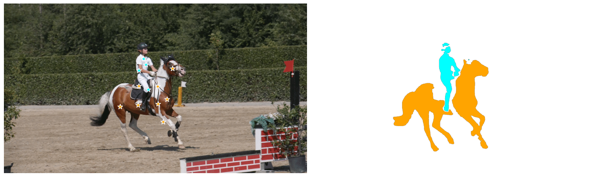

# Segment Anything Model Exploration

## Table of Contents

- [Preparation](#preparation)
- [Interactive Image Segmentation](#seg)
- [Video Object Segmentation](#vos)
- [References](#references)

## Preparation <a name="preparation"></a>
- Following the guide of [Segment Anything](https://github.com/facebookresearch/segment-anything)

## Interactive Image Segmentation <a name="seg"></a>
- [ ] Building GUI with ChatGPT

## Video Object Segmentation <a name="vos"></a>

<p align="center">
  
</p>

1. Input data in `demo/` folder is from [DAVIS](https://davischallenge.org/), organized in the following structure:
    ```
    demo/
        00000.png # initial masks
        00000.jpg # inital rgb frame
        00001.jpg
        ...
    ```
2. Notebook `vos_exp.ipynb` shows an example of using SAM for one-shot VOS
3. Apply the method above to multiple frames, then generate `vos_demo.gif` from output
```
ffmpeg -framerate 6 -i output/%05d.png -filter_complex "[0:v]palettegen=reserve_transparent=off:stats_mode=single [palette]; [0:v][palette]paletteuse" vos_demo.gif
```

## References <a name="references"></a>
- Segment Anything: [[`Paper`](https://ai.facebook.com/research/publications/segment-anything/)] [[`Project`](https://segment-anything.com/)]
